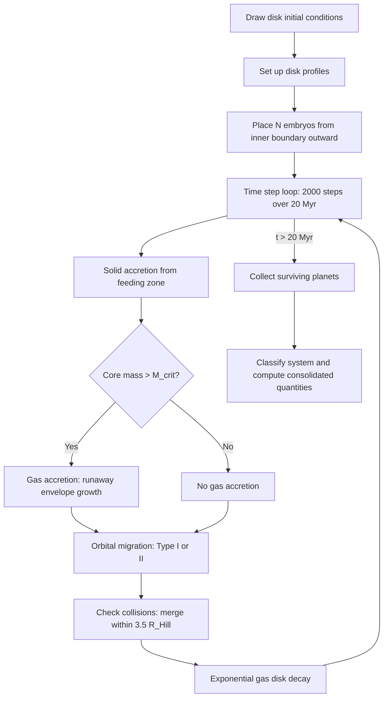

# Semi-Analytic Simulations

## Overview

To study the topology of the planetary architecture space, we need a **forward map** $F: \mathcal{D} \to \mathcal{A}$ from disk initial conditions to planetary system architectures. We generate this map by running thousands of semi-analytic planet formation simulations, following the population synthesis framework of [Miguel, Guilera & Brunini (2011)](https://arxiv.org/abs/1106.3281) and extended with the density perturbation model of [Chaparro Molano, Bautista & Miguel (2019)](https://arxiv.org/abs/1901.07078).

Each simulation takes a set of disk initial conditions, evolves embryos through solid accretion, gas accretion, migration, and collisions over 20 Myr, and outputs a planetary system.

## Input: disk initial conditions

Each simulation draws 5 parameters from observationally motivated prior distributions:

| Parameter                 | Symbol             | Distribution | Range                                              |
| ------------------------- | ------------------ | ------------ | -------------------------------------------------- |
| Stellar mass              | $M_\star$          | Log-uniform  | $0.7 - 1.4\;M_\odot$                               |
| Disk mass                 | $M_d$              | Log-Gaussian | $\mu=-2.05,\;\sigma=0.85$ (in $\log_{10} M_\odot$) |
| Characteristic radius     | $a_c$              | Log-Gaussian | $\mu=3.8,\;\sigma=0.18$ (in $\log_{10}$ AU)        |
| Metallicity               | $[\text{Fe/H}]$    | Gaussian     | $\mu=-0.02,\;\sigma=0.22$                          |
| Gas dissipation timescale | $\tau_\text{disc}$ | Log-uniform  | $10^6 - 10^7$ yr                                   |

Disks are rejected if they are gravitationally unstable (Toomre $Q < 1$) or if $M_d > 0.2\,M_\star$.

Two fixed parameters define each simulation configuration:

- **Density profile exponent** $\gamma \in \{0.5, 1.0, 1.5\}$: controls how mass is distributed in the inner disk.
- **Type I migration factor** $c_\text{migI} \in \{0, 0.01, 0.1, 1\}$: delays or disables inward migration of low-mass embryos.

## Disk structure

The gas surface density follows a power-law with exponential taper ([Andrews et al. 2009](https://doi.org/10.1088/0004-637X/700/2/1502)):

$$
\Sigma_g(r) = \Sigma_g^0 \left(\frac{r}{a_c}\right)^{-\gamma} \exp\left[-\left(\frac{r}{a_c}\right)^{2-\gamma}\right]
$$

The solid surface density has the same shape, scaled by metallicity and enhanced by a factor of 4 beyond the snow line (ice condensation).

For transitional disks, a radial density perturbation is superimposed ([Chaparro Molano et al. 2019](https://arxiv.org/abs/1901.07078)):

$$
\Sigma_p(r) = \Sigma(r)\left[1 + A\cos\left(\frac{2\pi r}{f\,H(r)}\right)\right]
$$

with perturbation amplitude $A = 0$ (smooth) or $A = 0.3$ (transitional).

## Planet formation algorithm

### Step 1: Embryo placement

Embryos are placed from the inner dust boundary $a_\text{in}$ (set by the dust sublimation temperature) outward, separated by $\Delta a = 10\,R_\text{Hill}$. The spacing depends on the local isolation mass, yielding $\sim$30--150 embryos per system.

Each embryo is seeded at its local **isolation mass** $M_\text{iso}$ (with a floor of 0.01 $M_\oplus$), representing the mass a body reaches when it has consumed all planetesimals in its feeding zone. This avoids the numerically expensive early growth phase from asteroid-sized seeds.

### Step 2: Solid accretion (oligarchic growth)

Each embryo accretes planetesimals from its feeding zone at a rate (Eq. 9 of Miguel et al.):

$$
\frac{dM_s}{dt} = 10.33\;\Sigma_s\;\Omega\;R_p^2\left(1 + \frac{2GM_t}{R_p\sigma^2}\right)
$$

where $R_p$ is the physical radius of the embryo, $\Omega$ is the Kepler frequency, and $\sigma$ is the planetesimal velocity dispersion. Accretion stops when the embryo has consumed all solids in its feeding zone (the **isolation mass**):

$$
M_\text{iso} = \frac{(20\pi\,a^2\,\Sigma_s)^{3/2}}{(3M_\star)^{1/2}}
$$

### Step 3: Gas accretion

When the solid accretion rate drops (the embryo approaches isolation), the critical mass $M_\text{crit}$ decreases. Once $M_\text{core} > M_\text{crit}$, the gas envelope contracts on the Kelvin-Helmholtz timescale:

$$
\tau_\text{KH} = 8.35 \times 10^{10}\left(\frac{M_t}{M_\oplus}\right)^{-4.89}\;\text{yr}
$$

This triggers **runaway gas accretion**, rapidly growing the planet to Jupiter-mass scales.

### Step 4: Migration

- **Type I**: low-mass planets migrate inward due to Lindblad torques, at a rate modulated by $c_\text{migI}$.
- **Type II**: planets massive enough to open a gap in the disk migrate on the viscous timescale.

### Step 5: Collisions

Embryos within 3.5 mutual Hill radii merge, with the more massive body absorbing the smaller one. The collision check runs in **multiple passes** per timestep until no further mergers occur, capturing cascade mergers where one collision changes the Hill radii of neighbors and triggers additional mergers. This is a significant growth channel, especially in the inner disk.

## Output

### Per system (raw)

A variable-length list of surviving planets, each characterized by:

- Semi-major axis $a$ (AU)
- Total mass $M_t = M_\text{core} + M_\text{envelope}$ ($M_\oplus$)
- Core mass $M_\text{core}$ ($M_\oplus$)

### Consolidated vector (for TDA)

Each system is summarized as a fixed-length 6-vector:

$$
\mathbf{x} = (N_\text{giant},\;N_\text{terrestrial},\;M_\text{terr,tot},\;\bar{M}_\text{terr},\;\eta,\;R_\text{COM})
$$

where $\eta = M_\text{planets}/M_\text{disk}$ is the mass efficiency and $R_\text{COM}$ is the mass-weighted mean semi-major axis. The point cloud $\{\mathbf{x}_i\}_{i=1}^N$ in $\mathbb{R}^6$ is the input to persistent homology.

### System classification

Following Miguel et al. (2011, Section 3.1), each system is classified into one of six types:

| Type              | Definition                                         |
| ----------------- | -------------------------------------------------- |
| Hot/warm Jupiters | Giant ($M > 15\,M_\oplus$) at $a < 1$ AU           |
| Solar systems     | Giants between 1--30 AU                            |
| Combined          | Giants both inside 1 AU and between 1--30 AU       |
| Cold Jupiters     | Giants only beyond 30 AU                           |
| Low mass          | All planets below $15\,M_\oplus$                   |
| Failed            | No planet exceeds Mercury mass ($0.055\,M_\oplus$) |
