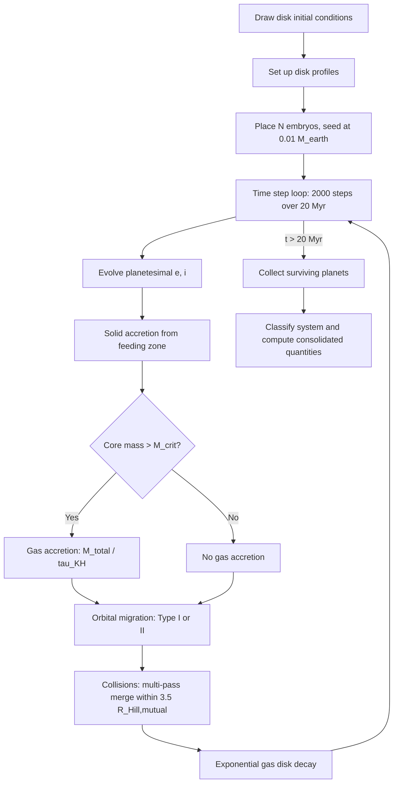

# Semi-Analytic Simulations

## Overview

To study the topology of the planetary architecture space, we need a **forward map** $F: \mathcal{D} \to \mathcal{A}$ from disk initial conditions to planetary system architectures. We generate this map by running thousands of semi-analytic planet formation simulations, drawing on prescriptions from multiple references:

- [Miguel, Guilera & Brunini (2011)](https://arxiv.org/abs/1106.3281) -- population synthesis framework and prior distributions
- [Guilera, Brunini & Benvenuto (2010)](https://arxiv.org/abs/1006.3821) -- solid accretion via Inaba et al. collision probability, eccentricity/inclination evolution
- [Ida & Lin (2004a)](https://arxiv.org/abs/astro-ph/0312144) -- gas accretion (Kelvin-Helmholtz prescription), Type II migration
- [Fortier, Alibert & Benz (2013)](https://arxiv.org/abs/1210.4009) -- oligarchic growth regime, initial embryo mass
- [Chaparro Molano, Bautista & Miguel (2019)](https://arxiv.org/abs/1901.07078) -- density perturbation model for transitional disks

Each simulation takes a set of disk initial conditions, evolves embryos through solid accretion, gas accretion, migration, and collisions over 20 Myr, and outputs a planetary system.

## Input: disk initial conditions

Each simulation draws 5 parameters from observationally motivated prior distributions (Miguel et al. 2011, Section 3):

| Parameter                 | Symbol             | Distribution | Range                                           | Source                                      |
| ------------------------- | ------------------ | ------------ | ----------------------------------------------- | ------------------------------------------- |
| Stellar mass              | $M_\star$          | Log-uniform  | $0.7 - 1.4\;M_\odot$                            | Miguel et al. (2011)                        |
| Disk mass                 | $M_d$              | Log-Gaussian | $\mu=-2.05,\;\sigma=0.85$ ($\log_{10} M_\odot$) | Andrews et al. (2009), Isella et al. (2009) |
| Characteristic radius     | $a_c$              | Log-Gaussian | $\mu=3.8,\;\sigma=0.18$ ($\log_{10}$ AU)        | Andrews et al. (2009), Isella et al. (2009) |
| Metallicity               | $[\text{Fe/H}]$    | Gaussian     | $\mu=-0.02,\;\sigma=0.22$                       | Mordasini et al. (2009)                     |
| Gas dissipation timescale | $\tau_\text{disc}$ | Log-uniform  | $10^6 - 10^7$ yr                                | Haisch et al. (2001), Hillenbrand (2005)    |

Disks are rejected if they are gravitationally unstable (Toomre $Q < 1$) or if $M_d > 0.2\,M_\star$ (Hartmann et al. 1998; Klahr et al. 2006).

Two fixed parameters define each simulation configuration:

- **Density profile exponent** $\gamma \in \{0.5, 1.0, 1.5\}$: controls how mass is distributed in the inner disk.
- **Type I migration factor** $c_\text{migI} \in \{0, 0.01, 0.1, 1\}$: delays or disables inward migration. When $c_\text{migI} = 0$, all migration (both Type I and Type II) is disabled.

## Disk structure

### Gas surface density

The gas surface density follows a power-law with exponential taper, motivated by similarity solutions for viscous accretion disks (Lynden-Bell & Pringle 1974; Andrews et al. 2009):

$$
\Sigma_g(r) = \Sigma_g^0 \left(\frac{r}{a_c}\right)^{-\gamma} \exp\left[-\left(\frac{r}{a_c}\right)^{2-\gamma}\right]
$$

The normalization $\Sigma_g^0$ is set by requiring the integral of $\Sigma_g(r)$ over the disk to equal the total disk mass $M_d$. This integral is evaluated numerically.

### Solid surface density

The solid surface density follows the same profile shape, scaled by the stellar metallicity and the primordial heavy-element abundance $z_0 = 0.0149$ (Lodders 2003):

$$
\Sigma_s^0 = \Sigma_g^0 \cdot z_0 \cdot 10^{[\text{Fe/H}]}
$$

An **ice-line enhancement** factor of 4 is applied beyond the snow line: $\eta_\text{ice} = 1/4$ inside the snow line, $\eta_\text{ice} = 1$ outside. The snow line radius scales with stellar luminosity as $r_\text{snow} \approx 2.7 \sqrt{L_\star / L_\odot}$ AU.

### Density perturbation (transitional disks)

For transitional disks, a radial density perturbation is superimposed on the solid surface density (Chaparro Molano et al. 2019, Eq. 1.1; Pinilla et al. 2012):

$$
\Sigma_p(r) = \Sigma_s(r)\left[1 + A\cos\left(\frac{2\pi r}{f\,H(r)}\right)\right]
$$

with perturbation amplitude $A$ (0 for smooth, 0.3 for transitional) and length scale parameter $f$. The scale height $H(r)$ is computed from the midplane temperature assuming vertical hydrostatic equilibrium.

### Gas disk evolution

The gas disk decays exponentially: $\Sigma_g(r, t) = \Sigma_g(r, 0) \cdot e^{-t/\tau_\text{disc}}$. This matches the simplest prescription shared by Guilera et al. (2010) and Ida & Lin (2004a). Viscous diffusion is not included in the current implementation.

## Planet formation algorithm

### Step 1: Embryo placement and seeding

Embryos are placed from the inner dust boundary outward. The inner boundary is set by the dust sublimation temperature (Vinkovic 2006):

$$
a_\text{in} = 0.0688 \left(\frac{1500\,\text{K}}{T_\text{sub}}\right)^2 \sqrt{\frac{L_\star}{L_\odot}} \;\text{AU}
$$

Embryos are separated by $\Delta a = 10\,R_\text{Hill}$, where the Hill radius is computed from the local isolation mass. This yields $\sim$30--150 embryos per system.

Each embryo is seeded at a fixed mass of **0.01 $M_\oplus$** (following Fortier et al. 2013, Section 5.1), representing a lunar-mass seed body. This mass is large enough to avoid numerical stiffness in the early growth phase but small enough that embryos must genuinely grow through accretion to reach giant planet cores.

### Step 2: Planetesimal eccentricity and inclination evolution

Planetesimal eccentricities and inclinations are tracked per embryo and evolved each timestep. The evolution is governed by two competing processes (Guilera et al. 2010, Eqs. 19--27):

**Gravitational stirring** by the protoplanet (Ohtsuki et al. 2002):

$$
\left(\frac{d\langle e^2 \rangle}{dt}\right)_\text{stirr} = \frac{M_P}{3\,b\,M_\star\,P} \, P_{VS}(\hat{e}, \hat{i})
$$

$$
\left(\frac{d\langle i^2 \rangle}{dt}\right)_\text{stirr} = \frac{M_P}{3\,b\,M_\star\,P} \, Q_{VS}(\hat{e}, \hat{i})
$$

where $\hat{e} = e\,a/R_H$ and $\hat{i} = i\,a/R_H$ are the reduced eccentricity and inclination. The viscous stirring coefficients $P_{VS}$ and $Q_{VS}$ depend on the ratio $\beta = \hat{i}/\hat{e}$ through elliptic integrals approximated by polynomial fits (Chambers 2006).

**Gas drag damping** (Adachi et al. 1976):

$$
\left(\frac{de}{dt}\right)_\text{gas} = -\frac{\pi\,e\,r_p^2\,C_D\,\rho_g\,v_K}{2\,m_p}\left(\eta^2 + v_\text{rel}^2\right)
$$

$$
\left(\frac{di}{dt}\right)_\text{gas} = -\frac{\pi\,i\,r_p^2\,C_D\,\rho_g\,v_K}{4\,m_p}\left(\eta^2 + v_\text{rel}^2\right)
$$

where $C_D \approx 1$ is the drag coefficient for spherical bodies, $r_p$ and $m_p$ are the planetesimal radius and mass (assuming 1 km, $\rho = 1.5$ g/cm$^3$), $\rho_g$ is the midplane gas density (converted from $\Sigma_g$ via the scale height), and $\eta = (v_K - v_\text{gas})/v_K$ is the sub-Keplerian headwind parameter.

The relative velocity between planetesimals and the protoplanet is:

$$
v_\text{rel} = \sqrt{\frac{5}{8}e^2 + \frac{1}{2}i^2}\;v_K
$$

The balance between stirring and damping determines the equilibrium eccentricity. With gas drag, eccentricities are substantially lower than the undamped oligarchic estimate $e \sim (M/M_\star)^{1/3}$, which directly affects accretion rates through the collision probability.

### Step 3: Solid accretion (particle-in-a-box)

Each embryo accretes planetesimals from its feeding zone using the particle-in-a-box formulation with the Inaba et al. (2001) three-regime collision probability (Guilera et al. 2010, Eq. 8):

$$
\frac{dM_C}{dt} = \frac{2\pi\,\Sigma_s(a_P)\,R_H^2}{P}\,P_\text{coll}
$$

The collision probability $P_\text{coll}$ depends on the capture radius $R_C$, the Hill radius $R_H$, and the planetesimal velocity state ($\hat{e}$, $\hat{i}$). Three regimes are defined (Guilera et al. 2010, Eqs. 9--11):

**High-velocity regime** ($\hat{e}, \hat{i} > 2$): dispersion-dominated encounters with gravitational focusing:

$$
P_\text{coll,high} = \frac{R_C^2}{2\pi R_H^2}\left[I_F(\beta) + \frac{6\,R_H\,I_G(\beta)}{R_C^2\,\hat{e}^2}\right]
$$

**Medium-velocity regime** ($0.2 < \hat{e}, \hat{i} < 2$): transition regime:

$$
P_\text{coll,med} = \frac{R_C^2}{4\pi R_H^2\,\hat{i}}\left[17.3 + \frac{232\,R_H}{R_C}\right]
$$

**Low-velocity regime** ($\hat{e}, \hat{i} < 0.2$): shear-dominated encounters:

$$
P_\text{coll,low} = 11.3\left[\frac{R_C}{R_H}\right]^{1/2}
$$

These are combined following Inaba et al. (2001):

$$
P_\text{coll} = \min\left[P_\text{coll,med},\;\left(P_\text{coll,low}^{-2} + P_\text{coll,high}^{-2}\right)^{-1/2}\right]
$$

The functions $I_F(\beta)$ and $I_G(\beta)$ are expressible in terms of elliptic integrals and approximated by rational polynomials (Chambers 2006).

Accretion stops when the embryo has consumed all solids in its feeding zone. The feeding zone extends $10\,R_\text{Hill}$ on either side (the embryo spacing $\Delta a$), and the available mass is:

$$
M_\text{fz} = 2\pi\,a \cdot 10\,R_\text{Hill} \cdot \Sigma_s
$$

The **isolation mass** -- the mass at which the feeding zone is depleted -- is:

$$
M_\text{iso} = \frac{(20\pi\,a^2\,\Sigma_s)^{3/2}}{(3M_\star)^{1/2}}
$$

This gives $\sim$2 $M_\oplus$ at the snow line and $\sim$10 $M_\oplus$ at 10 AU for a typical disk.

### Step 4: Gas accretion

Gas accretion is triggered when the core mass exceeds the critical mass. The critical mass depends on the solid accretion rate (Ida & Lin 2004a, Eq. 22; Ikoma et al. 2000):

$$
M_\text{crit} \approx 10\left(\frac{\dot{M}_c}{10^{-6}\,M_\oplus/\text{yr}}\right)^{1/4} M_\oplus
$$

As the embryo approaches isolation and the solid accretion rate $\dot{M}_c$ drops, $M_\text{crit}$ decreases. When $M_\text{core} > M_\text{crit}$, the gas envelope can no longer be supported by the energy from planetesimal accretion and begins to contract.

The gas accretion rate is (Ida & Lin 2004a, Eq. 23):

$$
\frac{dM_g}{dt} = \frac{M_t}{\tau_\text{KH}}
$$

where $M_t = M_\text{core} + M_\text{envelope}$ is the **total** planet mass (not just the envelope), and the Kelvin-Helmholtz contraction timescale is (Ida & Lin 2004a, Eq. 21):

$$
\tau_\text{KH} = 10^9 \left(\frac{M_t}{M_\oplus}\right)^{-3} \;\text{yr}
$$

This produces **runaway gas accretion**: as the envelope mass grows, $\tau_\text{KH}$ decreases, accelerating the accretion further. A 10 $M_\oplus$ core has $\tau_\text{KH} = 10^6$ yr; by 100 $M_\oplus$ the timescale has dropped to $10^3$ yr.

Gas accretion is limited by the local gas supply (10% of the gas in the feeding zone per timestep) and a fractional stability limit (50% of the total mass per timestep).

### Step 5: Migration

Migration is controlled by the $c_\text{migI}$ parameter. When $c_\text{migI} = 0$, all migration is disabled. Otherwise:

**Type I migration** (Tanaka et al. 2002; Miguel et al. 2011, Eq. 13) applies to planets below the gap-opening mass:

$$
\frac{\dot{a}}{a} = -c_\text{migI}\,(2.7 + 1.1\,\beta_\Sigma)\,\frac{M_p}{M_\star}\,\frac{\Sigma_g\,a^2}{M_\star}\,\left(\frac{a\,\Omega_K}{c_s}\right)^2\,\Omega_K
$$

where $\beta_\Sigma = \gamma + (2-\gamma)(a/a_c)^{2-\gamma}$ is the local surface density slope. This always produces inward migration.

**Type II migration** (Ida & Lin 2004a, Eq. 50) applies to planets that have opened a gap:

$$
\frac{\dot{a}}{a} = 3\,\text{sign}(a - R_m)\,\alpha\,\frac{\Sigma_{g,m}\,R_m^2}{M_p}\,\frac{\Omega_{K,m}}{\Omega_{K,p}}\,\left(\frac{h_m}{a}\right)^2\,\Omega_{K,m}
$$

All quantities with subscript "$_m$" are evaluated at $R_m$, the radius of maximum viscous couple. $R_m$ evolves outward with time (Ida & Lin 2004a, Eq. 54):

$$
R_m = 10\,\exp\left(\frac{2t}{5\,\tau_\text{disc}}\right)\;\text{AU}
$$

Planets inside $R_m$ migrate inward; planets outside $R_m$ migrate outward. The viscosity parameter is $\alpha = 10^{-3}$.

**Gap opening** uses the Crida et al. (2006) combined criterion, taking the maximum of the thermal condition ($M_\text{gap} \sim M_\star(h/r)^3$) and the viscous condition ($M_\text{gap} \sim 50\,\alpha\,(h/r)^2\,M_\star$).

### Step 6: Collisions

Embryos within 3.5 **mutual** Hill radii merge, with the more massive body absorbing the smaller one (Chambers 2006). The mutual Hill radius is:

$$
R_{H,\text{mutual}} = \left(\frac{M_i + M_j}{3\,M_\star}\right)^{1/3} \cdot \frac{a_i + a_j}{2}
$$

The collision check runs in **multiple passes** per timestep until no further mergers occur, capturing cascade mergers where one collision increases the Hill radius of the merged body and triggers additional mergers with neighbors. This is a significant growth channel, especially in the inner disk where embryos are closely spaced.

## Numerical implementation

- **Timestep**: $\Delta t = 10^4$ yr (2000 steps over 20 Myr)
- **Disk normalization**: computed once per simulation via numerical integration (cached in `DiskState`)
- **Growth limiting**: solid accretion capped by available mass in the feeding zone; gas accretion capped by 50% of total mass per step and 10% of local gas supply
- **Migration limiting**: orbital change capped at 5% of current semi-major axis per step
- **Inner boundary**: embryos migrating below $0.5 \times a_\text{in}$ are removed from the simulation

## Output

### Per system (raw)

A variable-length list of surviving planets, each characterized by:

- Semi-major axis $a$ (AU)
- Total mass $M_t = M_\text{core} + M_\text{envelope}$ ($M_\oplus$)
- Core mass $M_\text{core}$ ($M_\oplus$)

### Consolidated vector (for TDA)

Each system is summarized as a fixed-length 6-vector:

$$
\mathbf{x} = (N_\text{giant},\;N_\text{terrestrial},\;M_\text{terr,tot},\;\bar{M}_\text{terr},\;\eta,\;R_\text{COM})
$$

where $\eta = M_\text{planets}/M_\text{disk}$ is the mass efficiency and $R_\text{COM}$ is the mass-weighted mean semi-major axis. The point cloud $\{\mathbf{x}_i\}_{i=1}^N$ in $\mathbb{R}^6$ is the input to persistent homology.

### System classification

Following Miguel et al. (2011, Section 3.1), each system is classified into one of six types:

| Type              | Definition                                         |
| ----------------- | -------------------------------------------------- |
| Hot/warm Jupiters | Giant ($M > 15\,M_\oplus$) at $a < 1$ AU           |
| Solar systems     | Giants between 1--30 AU                            |
| Combined          | Giants both inside 1 AU and between 1--30 AU       |
| Cold Jupiters     | Giants only beyond 30 AU                           |
| Low mass          | All planets below $15\,M_\oplus$                   |
| Failed            | No planet exceeds Mercury mass ($0.055\,M_\oplus$) |

## Known limitations

The following physics is not yet included:

1. **Paardekooper Type I torques**: the current Type I migration formula (Tanaka 2002) only produces inward migration. The Paardekooper et al. (2011) formula includes corotation torques that create **outward migration zones**, which trap planets and prevent excessive inward migration. This is the likely cause of the elevated failure rate in our calibration.

2. **Planetesimal drift**: the solid disk is static. Guilera et al. (2010) solves a continuity equation for $\Sigma_s(r, t)$ with gas-drag-driven inward drift, which concentrates material in the inner disk and depletes the outer disk.

3. **Viscous gas evolution**: the gas disk evolves via simple exponential decay rather than the viscous diffusion equation. This misses self-consistent gap formation and inner-disk draining.

4. **Enhanced capture radius**: the collision cross-section uses the bare physical core radius. Inaba & Ikoma (2003) show that gas drag on planetesimals entering the protoplanetary envelope can enhance the effective capture radius by factors of 5--10.

5. **Planetesimal size distribution**: the current model assumes a single planetesimal size (1 km). Guilera et al. (2010) integrates over a power-law size distribution $dN/dm \propto m^{-5/2}$.
