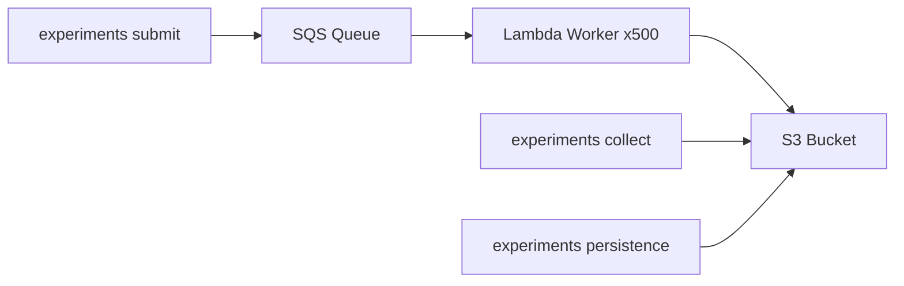

# Infrastructure

## Why serverless

A single planet formation simulation takes 1--75 seconds depending on the disk parameters. Running 1000 systems sequentially on a laptop would take ~4 hours. But each simulation is **independent** -- it takes a `DiskParams` input, runs the evolution, and writes a JSON result. This is a textbook embarrassingly parallel workload.

AWS Lambda lets us run all 1000 simulations concurrently with no provisioning, no idle costs, and no cluster management. At 500 concurrent invocations, a 1000-system population synthesis completes in **~80 seconds wall-clock** for **~\$0.30**.

## Architecture



### Components

| Resource        | Name                            | Purpose                                                                        |
| --------------- | ------------------------------- | ------------------------------------------------------------------------------ |
| **S3 Bucket**   | `topo-archeo-{env}-data`        | Stores manifests and simulation results                                        |
| **SQS Queue**   | `topo-archeo-simulations`       | Buffers simulation jobs; 6-min visibility timeout, 14-day retention            |
| **SQS DLQ**     | `topo-archeo-dead-letter`       | Captures failed jobs after 3 retries                                           |
| **Lambda**      | `topo_archeo__worker`           | Docker image (Python 3.14, ARM64), 512 MB, 5-min timeout, up to 500 concurrent |
| **GitHub OIDC** | `TopoArcheo-GitHubActions-Role` | Passwordless CI/CD deployment via OIDC federation                              |

All infrastructure is defined in AWS CDK (TypeScript) under `packages/infrastructure/` and deployed automatically on push to `main`.

### Lambda worker

The worker Lambda receives a single SQS message containing `DiskParams` and `ModelConfig`, runs `evolve_system()` and `consolidate()`, classifies the system, and writes the full result (planets, consolidated vector, system type) as JSON to S3:

```
s3://topo-archeo-{env}-data/results/{run_id}/{system_index}.json
```

The Docker image is built from `packages/infrastructure/lambda/worker/Dockerfile`, which installs `disk-evolution` from source on ARM64 for the target Lambda architecture.

### Manifest

Each run writes a `manifest.json` alongside the results:

```
s3://topo-archeo-{env}-data/results/{run_id}/manifest.json
```

The manifest records the full configuration (gamma, c_mig_i, perturbation amplitude, seed, N, timestamp), making every run fully reproducible and traceable.

## Cost

Lambda pricing is per GB-second (ARM64: \$0.0000133334/GB-s). Based on observed execution times across 2000+ invocations:

| Metric                       | Value                      |
| ---------------------------- | -------------------------- |
| Memory allocation            | 512 MB                     |
| Mean duration                | ~30s                       |
| Median billed per invocation | ~43s (includes cold start) |
| GB-seconds per invocation    | 21.5                       |
| **Cost per system**          | **\$0.000287**             |
| **Cost per 1000 systems**    | **\$0.29**                 |
| SQS + S3 overhead            | < \$0.01                   |

The full bifurcation sweep (7 runs, 7000 systems) cost approximately **\$2.00**.

For comparison, running the same 7000 systems sequentially on a laptop at ~30s each would take **~58 hours**.

## Usage

### Submit a run

```bash
uv run experiments submit \
  --n-systems 1000 \
  --gamma 1.0 \
  --c-mig-i 0.0 \
  --perturbation 0.3
```

Outputs a `run-id` (e.g., `run-6612a232d668`). All 1000 SQS messages are sent in ~5 seconds; Lambda processes them in ~80 seconds.

### Collect results

```bash
uv run experiments collect --run-id run-6612a232d668
```

Downloads all result files from S3, displays the run manifest (configuration and metadata), and prints the system classification table.

### Run TDA

```bash
uv run experiments persistence --run-id run-6612a232d668
```

Downloads the consolidated point cloud, computes Vietoris-Rips persistent homology, and displays the $H_0$/$H_1$ summary.

## Deployment

Infrastructure is deployed via CDK on every push to `main`:

```bash
# Manual deploy (requires AWS credentials)
yarn workspace @topo-archeo/infrastructure deploy --all --require-approval never
```

Required environment variables: `ENVIRONMENT` (`development` or `production`), `AWS_ACCOUNT`, `AWS_DEFAULT_REGION`.

The GitHub Actions release workflow handles this automatically using OIDC federation -- no AWS access keys are stored in the repository.
